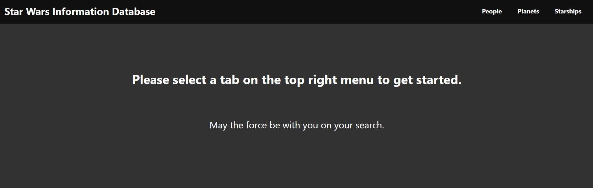
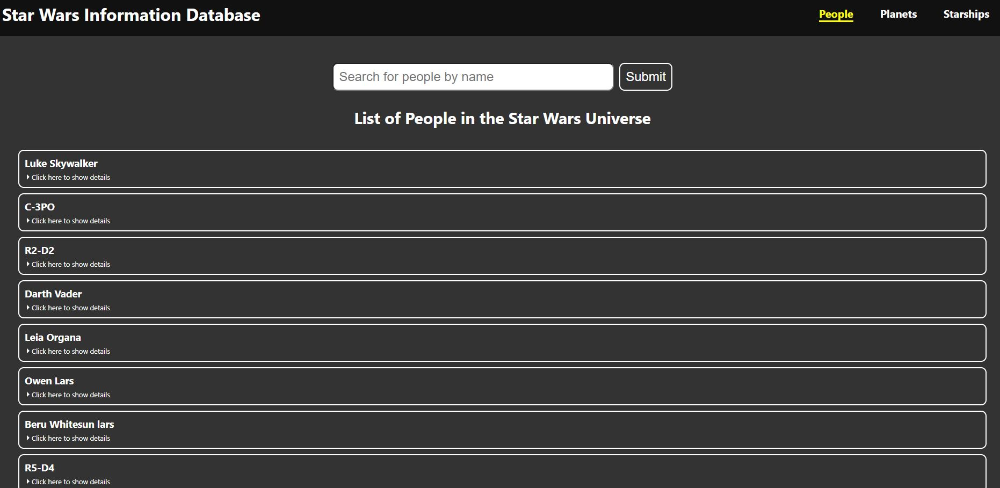
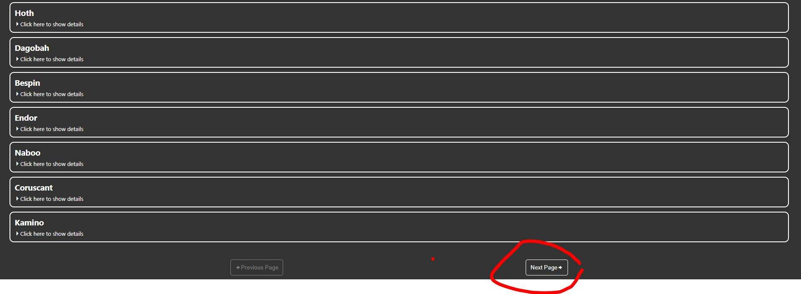
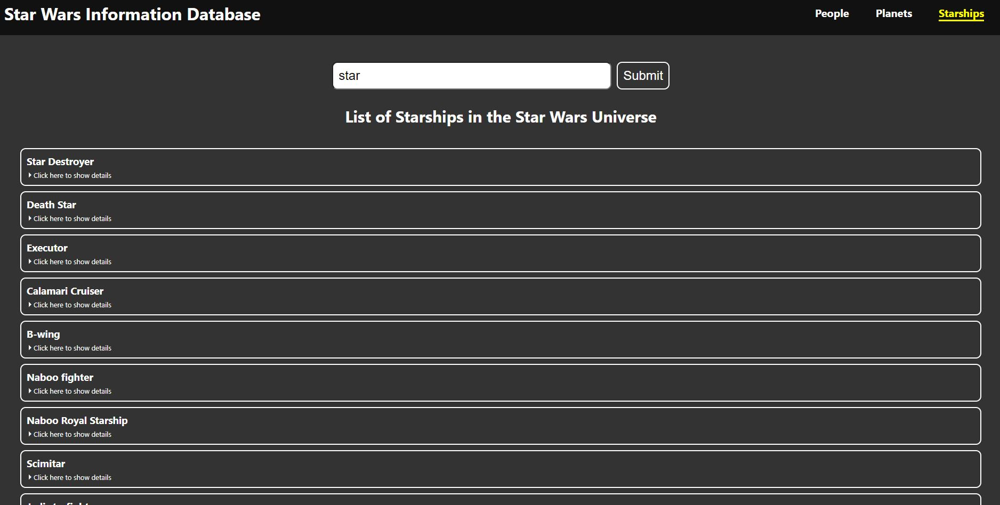

# Star-Wars-Database
ReactJS Application with a NodeJS virtual server using Star Wars API at https://swapi.dev/ to render an aggregation of results based on people, planets, and starships.

## NodeJS Server Endpoints

Example Endpoint for Reference: https://swapi.com/dev/people?search=skywalker&page=1

|ENDPOINTS|QUERY|METHOD|DESCRIPTION|
|---------|------|----|-----------|
|`/people`|`page`|GET|DEFAULT: Get a list of people (subdivided by 10 entries per page number query*)|
|`/people`|`search`|GET|Get a list of people filtered by query string matching name of person (not case sensitive)|
|`/planets`|`page`|GET|DEFAULT: Get a list of planets (subdivided by 10 entries per page number query*)|
|`/planets`|`search`|GET|Get a list of planets filtered by query string matching name of planet (not case sensitive)|
|`/starships`|`page`|GET|DEFAULT: Get a list of starships (subdivided by 10 entries per page number query*)|
|`/starships`|`search`|GET|Get a list of starships filtered by query string matching either name or model of the starship (not case sensitive)|

\* Page # by default endpoint query is `1`. Excluding the query will still result in returned results subdivided by page number.

---
## Getting Started
### VSCode
---
Two terminals must be opened simultaneously for the application to work properly.

NOTE: The following instructions are for PowerShell and Git Bash users. More to follow.

A) On the First Terminal (NodeJS Back End)
1) Type `cd server` and press enter to open the back end server folder
2) Type `yarn install` and press enter to install server dependencies for NodeJS
3) Type `yarn start` and press enter to start the virtual server
4) Once you are finished, press both `Ctrl` + `C` to terminate the NodeJS server.

B) On the Second Terminal (ReactJS Front End)
1) Type `cd client` and press enter to open the front end client folder
2) Type `yarn install` and press enter to install client dependencies for ReactJS
3) Type `yarn start` and press enter to start the React App Client
4) Once you are finished, press both `Ctrl` + `C` to terminate the ReactJS local host.

## Star Wars Database

Starting with the home page, please select one of three tabs at the top right corner to get started.

---

To look for people in the Star Wars Universe, select `people`. Likewise for planets and starships, select `planets` and `starships` respectively.

In all three tabs, you will see a list of items generated from the external Star Wars API (see https://swapi.dev/ for details and documentation)

---

Results are aggregated in tens, so you have to press the next page to load the next set of items in that category.

If you would like to return to the previous page, just click on the Previous Page button.

---

Alternatively, you can use the search box which will only return up to the first ten results based on the name of the entry (starships entries include both name and/or model identification; example: The Ship "Executor" has a model name called "Executor-class star dreadnought", so if you search "star", any queries involving the name or model name will be included) you enter and click on the submit button (alternatively, pressing the "Enter" key on your keyboard also works).
